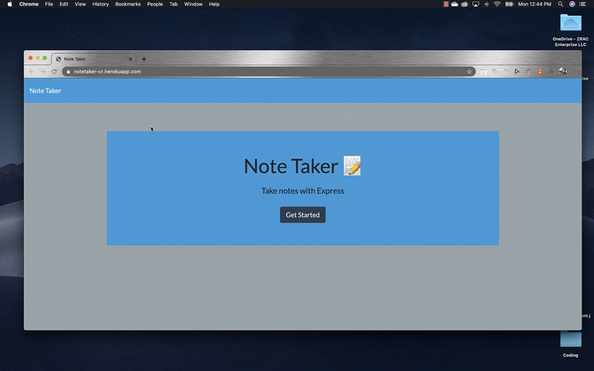

# noteTaker
    

    
## Description of this noteTaker Application
    
It is teaching me the basic of api routes to .get/.post and .delete. It also showed me how to assign ID when a user inputs a note. The application saves your note with title and body/text and displays it in a list format to the right of the input field, with a delete button giving us the ability to delete any note we no longer want saved. 
    
## Table of Contents
- [What you'll need to run program](#install)
- [How to Use Application](#step-By-step)
- [License](#license)
- [How to use Application](#howToUse)
- [Example](#Example)
- [Contributors](#contributors-/-Credits)
    
## Install
You will need these packages to run the Generator
 * Always with the basic, node followed by: express, fs, path, nodemon and a new package i found. uniqid
    
## Step By Step
 * simply run npm i, as all the dependencies are in the package.json and it'll run all the above packages. 
    
## How to Use
 * For this application to run, you will need to use Heroku. Create an account with Heroku, follow all of their instructions to push your code to your profile. Once your code is pushed, go to settings, scroll down, on the domain section you will see the link to your app, you can now use your costume noteTaker app to use to make, save and delete notes. See example below. 
    
## Example

    
## License
    
 * MIT
    
## Contributors / Credits
    
 * Kit Te, Lindsey Smith and Jeremy Jones helped guide me through this. 
    
## Author
 * Christopher Rojas
    

    
## Git Hub User Name
 * sfcarz
    
## Author Git Hub URL Link
(https://github.com/sfcarz)
    